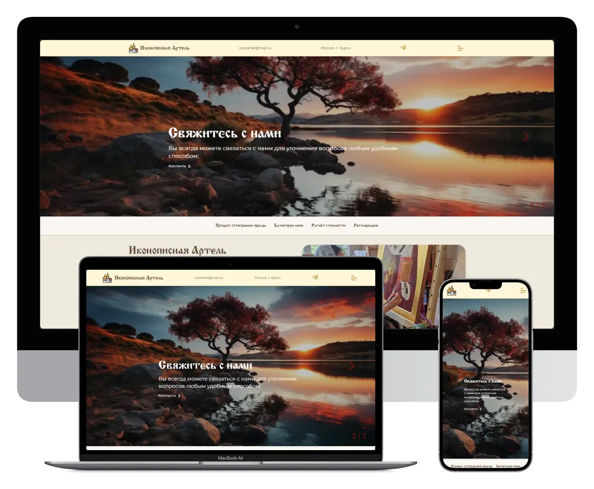

# Icon Painting Artel

[🇬🇧 English](#english) | [🇷🇺 Русский](#русский)

---

## English

### Icon Painting Artel

Project: https://icon-artel.ru

A private project on React + Next.js

---

### About the project

#### Functionality

- Cockpit CMS
- Swiper is integrated

#### Pages

- Main

#### Not Implemented

- Integration with Telegram and VK

---

### License

This project is licensed under the [GNU Affero General Public License v3 (AGPLv3)](https://www.gnu.org/licenses/agpl-3.0.html).

---

### Contacts

Author: Yuriy Plotnikov
Website: https://yuriyplotnikovv.ru

---

## Русский

### Иконописная Артель

Проект: https://icon-artel.ru

Частный проект на React + Next.js

---

### О проекте

#### Функциональность

- Cockpit CMS
- Подключен Swiper

#### Страницы

- Главная

#### Не реализовано

- Интеграция с Telegram и ВК

---

### Лицензия

Проект распространяется под лицензией [GNU Affero General Public License v3 (AGPLv3)](https://www.gnu.org/licenses/agpl-3.0.html).

---

### Контакты

Автор: Yuriy Plotnikov
Сайт: https://yuriyplotnikovv.ru
